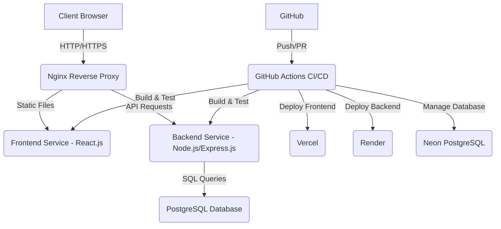

# Architecture Document: Integrated Blood Bank Donation and Request System

## 1. Introduction
This document outlines the architectural design of the Integrated Blood Bank Donation and Request System. The system is a full-stack web application designed to streamline the process of blood donation, inventory management, and emergency blood requests. It aims to provide a robust, scalable, secure, and user-friendly platform for donors, hospitals, and administrators.

## 2. System Overview
The system adopts a microservices-oriented approach, separating concerns into distinct layers: Frontend, Backend, and Database. These layers communicate through well-defined interfaces, primarily RESTful APIs. Docker is utilized for containerization, ensuring consistent environments across development and deployment, while GitHub Actions provide continuous integration and continuous deployment (CI/CD) capabilities.

## 3. High-Level Architecture

**Components:**
- **Client Browser**: Users interact with the system through a web browser.
- **Nginx Reverse Proxy**: Acts as the entry point, serving static frontend assets and routing API requests to the backend.
- **Frontend Service (React.js)**: A Single Page Application (SPA) built with React.js, providing the user interface and experience.
- **Backend Service (Node.js/Express.js)**: A RESTful API handling business logic, data validation, authentication, and communication with the database.
- **PostgreSQL Database**: The primary data store for all system information, managed by Neon for cloud deployment.
- **GitHub Actions CI/CD**: Automates the build, test, and deployment processes upon code changes.
- **Vercel**: Platform for deploying the frontend application.
- **Render**: Platform for deploying the backend application.
- **Neon PostgreSQL**: Cloud-native PostgreSQL service for the database.

## 4. Detailed Architecture

### 4.1. Frontend Architecture
- **Technology Stack**: React.js, Tailwind CSS, React Router, Axios, Framer Motion.
- **Structure**: Organized into reusable components, pages, layouts, hooks, services, context for state management, and routing definitions.
- **Key Features**: 
    - **SPA (Single Page Application)**: Provides a fluid user experience without full page reloads.
    - **Responsive Design**: Adapts to various screen sizes (desktop, tablet, mobile).
    - **Modern UI/UX**: Incorporates premium SaaS dashboard design principles, glassmorphism effects, smooth animations, interactive elements (tables, charts), and dark mode support.
    - **Protected Routes**: Ensures only authenticated and authorized users can access certain parts of the application.
    - **State Management**: Utilizes React Context API for global state management (e.g., authentication status).
    - **API Integration**: Uses Axios for making HTTP requests to the backend API.

### 4.2. Backend Architecture
- **Technology Stack**: Node.js, Express.js, PostgreSQL (via `pg` library), JWT for authentication, bcrypt for password hashing, express-validator for input validation, dotenv for environment variables, Winston for logging.
- **Structure**: Follows a layered architecture with clear separation of concerns:
    - **Controllers**: Handle incoming requests, validate input, and delegate to services.
    - **Services**: Contain the core business logic and interact with the database.
    - **Models**: Represent data structures and database interactions (if using an ORM, though direct `pg` queries are used here).
    - **Routes**: Define API endpoints and map them to controllers.
    - **Middleware**: Intercept requests for authentication, authorization, error handling, and logging.
    - **Config**: Database connection and other application configurations.
    - **Utils**: Helper functions (e.g., logger, JWT generation).
- **Key Features**:
    - **RESTful APIs**: Adheres to REST principles for resource-oriented communication.
    - **Secure Authentication**: JWT-based authentication with bcrypt for password hashing.
    - **Role-Based Authorization**: Middleware to restrict access based on user roles (admin, donor, hospital).
    - **Centralized Error Handling**: A dedicated middleware for consistent error responses and logging.
    - **Input Validation**: Ensures data integrity and security against common vulnerabilities.
    - **Logging**: Comprehensive logging using Winston for monitoring and debugging.
    - **HTTPS-ready**: Designed for easy integration with HTTPS in production environments.

### 4.3. Database Architecture
- **Technology Stack**: PostgreSQL (specifically Neon for cloud deployment).
- **Design Principles**:
    - **ACID Compliance**: Ensures data integrity, consistency, isolation, and durability.
    - **Optimized Schema**: Designed for efficient data retrieval and storage, with appropriate indexing.
    - **Referential Integrity**: Utilizes foreign keys to maintain relationships between tables.
    - **Secure Access Control**: Configured for secure connections and user permissions.
    - **Encryption-ready**: Supports data encryption at rest and in transit.
- **Key Tables**:
    - `users`: Stores user authentication details and roles.
    - `donors`: Stores specific information about blood donors.
    - `hospitals`: Stores specific information about hospitals.
    - `blood_inventory`: Tracks quantities of different blood types.
    - `donations`: Records individual blood donation events.
    - `emergency_requests`: Manages blood requests from hospitals.
    - `notifications`: Stores system notifications for users.
    - `activity_logs`: Records user and system activities for auditing.
- **Migrations**: Supports database schema evolution through migration scripts.

### 4.4. DevOps Architecture
- **Tools**: Git, GitHub, GitHub Actions, Docker, Docker Compose, Nginx.
- **Key Aspects**:
    - **Version Control**: All code managed in Git and hosted on GitHub.
    - **Containerization (Docker)**: Each service (frontend, backend, database) runs in its own Docker container, ensuring environment consistency.
    - **Orchestration (Docker Compose)**: Used for local development to define and run multi-container Docker applications.
    - **CI/CD (GitHub Actions)**: Automated workflows for:
        - **Continuous Integration**: Triggers on push/pull requests to run tests (backend unit tests, frontend build) to ensure code quality and prevent regressions.
        - **Continuous Deployment**: Triggers on merges to the `main` branch to deploy the frontend to Vercel and the backend to Render.
    - **Nginx Reverse Proxy**: Used in production to efficiently serve the frontend and proxy requests to the backend.
    - **Logging and Monitoring**: Integrated logging (Winston) in the backend, with provisions for external monitoring solutions.
    - **Rollback Strategy**: Docker images and Git history allow for easy rollbacks to previous stable versions.

## 5. Deployment Strategy

- **Frontend Deployment**: Leverages Vercel for its seamless integration with React applications, automatic scaling, and global CDN for fast content delivery.
- **Backend Deployment**: Utilizes Render for hosting the Node.js/Express.js API, offering continuous deployment from GitHub and managed infrastructure.
- **Database Deployment**: Employs Neon PostgreSQL, a serverless PostgreSQL offering, for its scalability, reliability, and ease of management.

This architecture ensures a robust, maintainable, and scalable foundation for the Integrated Blood Bank Donation and Request System, capable of handling enterprise-level requirements.
