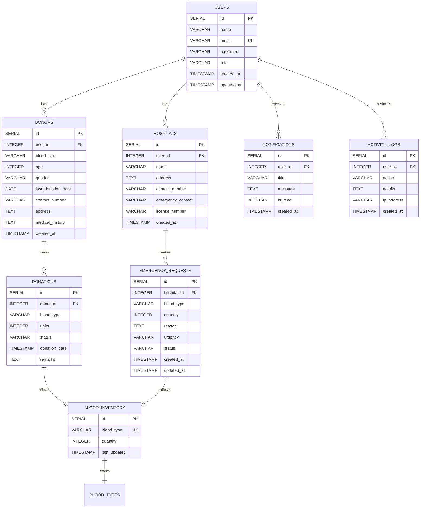

# Database Design: Integrated Blood Bank Donation and Request System

This document details the database design for the Integrated Blood Bank Donation and Request System, focusing on schema, relationships, and data integrity.

## 1. Database Technology

- **Primary Database**: PostgreSQL (specifically [Neon PostgreSQL](https://neon.tech/) for cloud deployment).
- **Rationale**: PostgreSQL is chosen for its robustness, ACID compliance, extensibility, and strong support for complex queries and data types. Neon provides a serverless, scalable, and cost-effective solution for cloud-native PostgreSQL.

## 2. Design Principles

-   **ACID Compliance**: Ensures that database transactions are processed reliably. This guarantees validity even in the event of errors, power failures, etc.
-   **Normalized Schema**: Designed to minimize data redundancy and improve data integrity, typically up to 3rd Normal Form.
-   **Referential Integrity**: Enforced using Foreign Key constraints to maintain consistency between related tables.
-   **Indexing**: Strategic use of indexes to optimize query performance for frequently accessed columns.
-   **Security**: Implementation of secure access controls and consideration for encryption of sensitive data.
-   **Scalability**: Designed to handle increasing data volumes and user loads, leveraging PostgreSQL features and Neon's serverless architecture.

## 3. Entity-Relationship Diagram (Conceptual)

## 4. Table Descriptions

### `users` Table
-   **Purpose**: Stores user authentication details and roles within the system.
-   **Columns**:
    -   `id`: Unique identifier for the user (Primary Key).
    -   `name`: Full name of the user.
    -   `email`: Unique email address of the user (Unique Key, used for login).
    -   `password`: Hashed password of the user.
    -   `role`: User's role (`admin`, `donor`, `hospital`). Default is `donor`.
    -   `created_at`: Timestamp of user creation.
    -   `updated_at`: Timestamp of last user update.

### `donors` Table
-   **Purpose**: Stores specific information related to blood donors.
-   **Columns**:
    -   `id`: Unique identifier for the donor (Primary Key).
    -   `user_id`: Foreign Key to `users` table, linking donor profile to a user account.
    -   `blood_type`: Blood type of the donor (e.g., 'A+', 'O-').
    -   `age`: Age of the donor.
    -   `gender`: Gender of the donor.
    -   `last_donation_date`: Date of the donor's last blood donation.
    -   `contact_number`: Donor's contact phone number.
    -   `address`: Donor's residential address.
    -   `medical_history`: Relevant medical history (can be sensitive, consider encryption).
    -   `created_at`: Timestamp of donor profile creation.

### `hospitals` Table
-   **Purpose**: Stores specific information related to hospitals registered in the system.
-   **Columns**:
    -   `id`: Unique identifier for the hospital (Primary Key).
    -   `user_id`: Foreign Key to `users` table, linking hospital profile to a user account.
    -   `name`: Name of the hospital.
    -   `address`: Hospital's physical address.
    -   `contact_number`: General contact number for the hospital.
    -   `emergency_contact`: Emergency contact number for the hospital.
    -   `license_number`: Hospital's operating license number.
    -   `created_at`: Timestamp of hospital profile creation.

### `blood_inventory` Table
-   **Purpose**: Tracks the current stock levels of different blood types.
-   **Columns**:
    -   `id`: Unique identifier for the inventory record (Primary Key).
    -   `blood_type`: Unique blood type (e.g., 'A+', 'O-') (Unique Key).
    -   `quantity`: Current quantity of blood units for that type.
    -   `last_updated`: Timestamp of the last inventory update.

### `donations` Table
-   **Purpose**: Records individual blood donation events.
-   **Columns**:
    -   `id`: Unique identifier for the donation record (Primary Key).
    -   `donor_id`: Foreign Key to `donors` table.
    -   `blood_type`: Blood type donated.
    -   `units`: Number of units donated.
    -   `status`: Status of the donation (`pending`, `approved`, `rejected`, `completed`).
    -   `donation_date`: Date and time of the donation.
    -   `remarks`: Any additional notes or remarks about the donation.

### `emergency_requests` Table
-   **Purpose**: Manages blood requests made by hospitals.
-   **Columns**:
    -   `id`: Unique identifier for the request (Primary Key).
    -   `hospital_id`: Foreign Key to `hospitals` table.
    -   `blood_type`: Blood type requested.
    -   `quantity`: Quantity of blood units requested.
    -   `reason`: Reason for the request (e.g., 'surgery', 'accident').
    -   `urgency`: Urgency level of the request (`normal`, `urgent`, `emergency`).
    -   `status`: Current status of the request (`pending`, `approved`, `rejected`, `in-transit`, `completed`).
    -   `created_at`: Timestamp of request creation.
    -   `updated_at`: Timestamp of last request update.

### `notifications` Table
-   **Purpose**: Stores system-generated notifications for users.
-   **Columns**:
    -   `id`: Unique identifier for the notification (Primary Key).
    -   `user_id`: Foreign Key to `users` table, indicating the recipient.
    -   `title`: Title of the notification.
    -   `message`: Full content of the notification.
    -   `is_read`: Boolean flag indicating if the notification has been read.
    -   `created_at`: Timestamp of notification creation.

### `activity_logs` Table
-   **Purpose**: Records significant user and system activities for auditing and monitoring.
-   **Columns**:
    -   `id`: Unique identifier for the log entry (Primary Key).
    -   `user_id`: Foreign Key to `users` table, indicating the user who performed the action (can be NULL for system actions).
    -   `action`: Description of the action performed (e.g., 'user_login', 'inventory_update').
    -   `details`: Additional details about the action.
    -   `ip_address`: IP address from which the action originated.
    -   `created_at`: Timestamp of the activity.

## 5. Indexes

Indexes are created on frequently queried columns to speed up data retrieval operations:

-   `idx_users_email` on `users(email)`: For fast user lookup during login.
-   `idx_donors_blood_type` on `donors(blood_type)`: For efficient filtering of donors by blood type.
-   `idx_blood_inventory_type` on `blood_inventory(blood_type)`: For quick access to specific blood type inventory.
-   `idx_requests_status` on `emergency_requests(status)`: For filtering requests by their current status.
-   `idx_requests_blood_type` on `emergency_requests(blood_type)`: For filtering requests by blood type.

## 6. Backup Strategy

-   **Automated Backups**: Neon PostgreSQL provides automated daily backups and point-in-time recovery. It is recommended to configure these settings according to recovery point objective (RPO) and recovery time objective (RTO) requirements.
-   **Manual Backups**: For critical data or before major schema changes, manual backups can be performed using `pg_dump` or Neon's snapshot features.
-   **Offsite Storage**: Backups should be stored in a separate geographical location to protect against regional disasters.

## 7. Security Considerations

-   **Least Privilege**: Database users should be granted only the minimum necessary permissions.
-   **Connection Encryption**: Always use SSL/TLS for database connections to encrypt data in transit.
-   **Data Encryption at Rest**: For highly sensitive data (e.g., medical history), consider column-level encryption or leveraging database-level encryption features.
-   **Regular Audits**: Periodically review activity logs and database access patterns for suspicious activities.
-   **Strong Passwords**: Enforce strong password policies for database users.

This comprehensive database design ensures a robust, secure, and performant foundation for the Blood Bank Donation and Request System.
